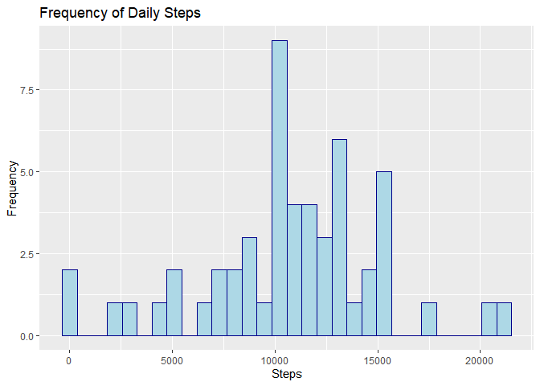
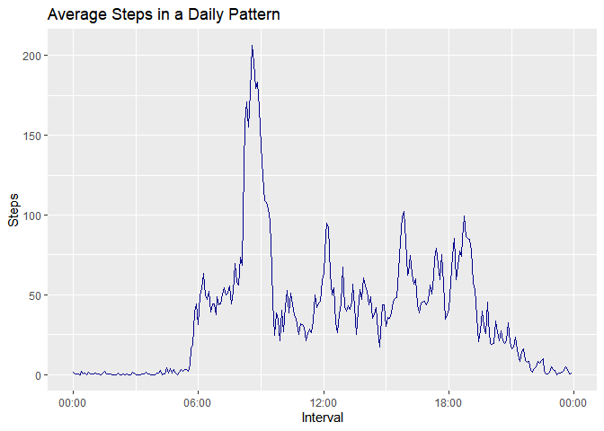
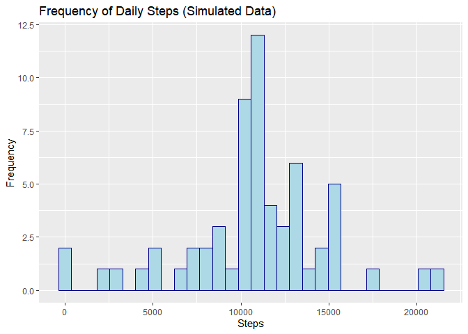
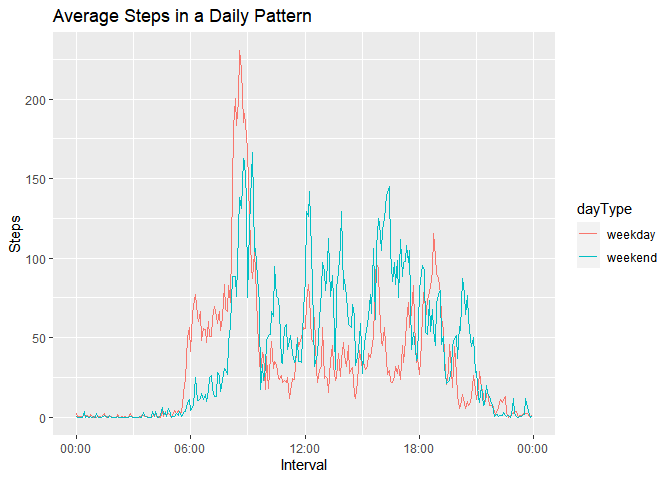

## Loading libraries


```r
library(ggplot2)
library(dplyr)
```

```
## 
## Attaching package: 'dplyr'
```

```
## The following objects are masked from 'package:stats':
## 
##     filter, lag
```

```
## The following objects are masked from 'package:base':
## 
##     intersect, setdiff, setequal, union
```

```r
library(knitr)
```


## Loading and preprocessing the data


```r
opts_knit$set(fig_path = './figs')
unzip("activity.zip")
monitorData <- as_tibble(read.csv("activity.csv"))


monitorData <- monitorData %>%
    ## Reassigning the date format
    mutate(date = as.Date(date, format = "%Y-%m-%d")) %>%
    ## Reformatting the interval 5 -> 0005
    mutate(interval_format = sprintf("%04d", interval)) %>%
    ## Converting to date format
    mutate(interval_time = strptime(interval_format, format = "%H%M"))
```


## What is mean total number of steps taken per day?

For this part of the assignment, you can ignore the missing values in the dataset.

1. Calculate the total number of steps taken per day


```r
totalStepsPerDay <- aggregate(steps ~ date, monitorData, sum)
head(totalStepsPerDay)
```

```
##         date steps
## 1 2012-10-02   126
## 2 2012-10-03 11352
## 3 2012-10-04 12116
## 4 2012-10-05 13294
## 5 2012-10-06 15420
## 6 2012-10-07 11015
```


2. If you do not understand the difference between a histogram and a barplot, research the difference between them. Make a histogram of the total number of steps taken each day


```r
ggplot(totalStepsPerDay, aes(x = steps)) +
    geom_histogram(color = "darkblue", fill = "lightblue") +
    labs(title = "Frequency of Daily Steps", x = "Steps", y = "Frequency")
```

```
## `stat_bin()` using `bins = 30`. Pick better value with `binwidth`.
```

<!-- -->

3. Calculate and report the mean and median of the total number of steps taken per day


```r
paste("Mean:", mean(totalStepsPerDay$steps, na.rm = TRUE))
```

```
## [1] "Mean: 10766.1886792453"
```

```r
paste("Median:", median(totalStepsPerDay$steps, na.rm = TRUE))
```

```
## [1] "Median: 10765"
```

## What is the average daily activity pattern?

1. Make a time series plot (i.e. type = "l") of the 5-minute interval (x-axis) and the average number of steps taken, averaged across all days (y-axis)


```r
library(scales)
intervalStep <- aggregate(steps ~ interval_format, monitorData, mean)
#head(intervalStep)
ggplot(intervalStep, aes(x = as.POSIXct(interval_format, format = "%H%M"), y = steps)) +
        geom_line(colour = "darkblue", size = 0.6) +
        labs(x = "Interval", y = "Steps", title = "Average Steps in a Daily Pattern") +
        scale_x_datetime(date_labels = "%H:%M")
```

<!-- -->

2. Which 5-minute interval, on average across all the days in the dataset, contains the maximum number of steps?


```r
filter(intervalStep, steps == max(steps))
```

```
##   interval_format    steps
## 1            0835 206.1698
```
**Here we can see that the interval with the highest average value of steps is at 08:35 with 206.16 steps**

## Imputing missing values

Note that there are a number of days/intervals where there are missing values (coded as 'NA'). The presence of missing days may introduce bias into some calculations or summaries of the data.

1. Calculate and report the total number of missing values in the dataset (i.e. the total number of rows with NAs)


```r
paste("NAs in 'steps' column:", sum(is.na(monitorData$steps)))
```

```
## [1] "NAs in 'steps' column: 2304"
```

```r
paste("NAs in 'date' column:", sum(is.na(monitorData$date)))
```

```
## [1] "NAs in 'date' column: 0"
```

```r
paste("NAs in 'interval' column:", sum(is.na(monitorData$interval)))
```

```
## [1] "NAs in 'interval' column: 0"
```

2. Devise a strategy for filling in all of the missing values in the dataset. The strategy does not need to be sophisticated. For example, you could use the mean/median for that day, or the mean for that 5-minute interval, etc.

**I will impute the values with the mean for each hour interval**

3. Create a new dataset that is equal to the original dataset but with the missing data filled in.


```r
# Making a join between the monitor and intervalStep dataframes
temp <- full_join(monitorData, intervalStep, by = "interval_format")

# Changing data type of steps.x to double
temp <- mutate(temp, steps.x = as.double(steps.x))

# By the looping inside the dataframe, we reassign the mean value from steps.y where steps.x has an NA
for(i in 1:nrow(temp)){
    if(is.na(temp[i, "steps.x"])){
        temp[i, "steps.x"] <- temp[i, "steps.y"]
    }
}
```

Making the new dataset "equal" to the original

```r
# Renaming and filtering columns
monitorImputed <- temp %>% 
    select(steps.x, date, interval, interval_format) %>%
    rename(steps = steps.x)
head(monitorImputed)
```

```
## # A tibble: 6 × 4
##    steps date       interval interval_format
##    <dbl> <date>        <int> <chr>          
## 1 1.72   2012-10-01        0 0000           
## 2 0.340  2012-10-01        5 0005           
## 3 0.132  2012-10-01       10 0010           
## 4 0.151  2012-10-01       15 0015           
## 5 0.0755 2012-10-01       20 0020           
## 6 2.09   2012-10-01       25 0025
```

4. Make a histogram of the total number of steps taken each day and Calculate and report the mean and median total number of steps taken per day. Do these values differ from the estimates from the first part of the assignment? What is the impact of imputing missing data on the estimates of the total daily number of steps?


```r
totalStepsSimulated <- aggregate(steps ~ date, monitorImputed, sum)
ggplot(totalStepsSimulated, aes(x = steps)) +
    geom_histogram(color = "darkblue", fill = "lightblue") +
    labs(title = "Frequency of Daily Steps (Simulated Data)", x = "Steps", y = "Frequency")
```

```
## `stat_bin()` using `bins = 30`. Pick better value with `binwidth`.
```

<!-- -->

We can see that there's a slight change between the position in x for the maximum values.


```r
paste("(Simulated) Mean:", mean(totalStepsSimulated$steps, na.rm = TRUE))
```

```
## [1] "(Simulated) Mean: 10766.1886792453"
```

```r
paste("(Simulated) Median:", median(totalStepsSimulated$steps, na.rm = TRUE))
```

```
## [1] "(Simulated) Median: 10766.1886792453"
```
The mean remain nearly the same, but the median has incremented a lot in order to be the same as the mean.

## Are there differences in activity patterns between weekdays and weekends?

For this part the **weekdays()** function may be of some help here. Use the dataset with the filled-in missing values for this part.

Create a new factor variable in the dataset with two levels – “weekday” and “weekend” indicating whether a given date is a weekday or weekend day.


```r
library(timeDate)
```

```
## Warning: package 'timeDate' was built under R version 4.2.1
```

```r
monitorImputed$dayType <- "weekday"
monitorImputed$dayType[isWeekend(monitorImputed$date)] <- "weekend"
monitorImputed$dayType <- as.factor(monitorImputed$dayType)
```


Make a panel plot containing a time series plot (i.e. type = "l") of the 5-minute interval (x-axis) and the average number of steps taken, averaged across all weekday days or weekend days (y-axis). See the README file in the GitHub repository to see an example of what this plot should look like using simulated data.


```r
intervalStepImputed <- aggregate(steps ~ interval_format + dayType, monitorImputed, mean)
#head(intervalStep)
ggplot(intervalStepImputed, aes(x = as.POSIXct(interval_format, format = "%H%M"), y = steps)) +
        geom_line(aes(colour = dayType), size = 0.7) +
        labs(x = "Interval", y = "Steps", title = "Average Steps in a Daily Pattern") +
        scale_x_datetime(date_labels = "%H:%M")
```

<!-- -->

As we can see from the plot, the weekdays have the peak value. But along the day the weekend seems to have more steps count.

Just for the fun, we'll see at the mean and median value for each dayType.


```r
weekd <- intervalStepImputed %>%
    filter(dayType == "weekday")
weekend <- intervalStepImputed %>%
    filter(dayType == "weekend")

paste("Weekday Mean:", mean(weekd$steps, na.rm = TRUE))
```

```
## [1] "Weekday Mean: 35.6105811786629"
```

```r
paste("Weekday Median:", median(weekd$steps, na.rm = TRUE))
```

```
## [1] "Weekday Median: 25.8031446540881"
```

```r
paste("Weekend Mean:", mean(weekend$steps, na.rm = TRUE))
```

```
## [1] "Weekend Mean: 42.366401336478"
```

```r
paste("Weekend Median:", median(weekend$steps, na.rm = TRUE))
```

```
## [1] "Weekend Median: 32.3396226415094"
```

